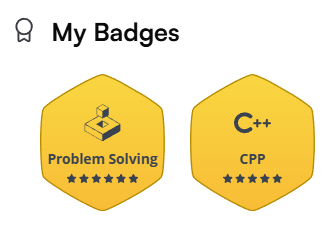

This repository contains my solutions to various [HackerRank - Problem Solving](https://www.hackerrank.com/domains/algorithms?badge_type=problem-solving) problems of difficulty **Medium** and **Hard** only. I have completed **7 weeks** of the [3-month preparation kit](https://www.hackerrank.com/interview/preparation-kits/three-month-preparation-kit/three-month-week-one/challenges), and this repository serves as a structured archive of my journey.

Each problem is saved as a `.cpp` file in which:
- I link the problem website at the beginning of the file.
- My full implementation is in C++.
- I also leave detailed breakdown of the approach, ensuring that even after a long time, I can myself revisit and quickly understand the solution.

